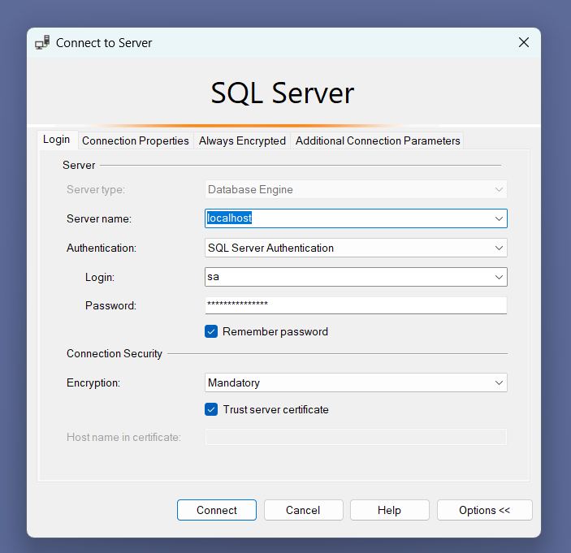

## Introduction
Continuing on the theme of running services in containers, let's look at how to run SQL Server 2022 in a container using Docker. This is a great way to test SQL Server locally without having to install it on your local machine.

Link: https://learn.microsoft.com/en-us/sql/linux/quickstart-install-connect-docker?view=sql-server-ver16&tabs=cli&pivots=cs1-powershell

## Pull and run the SQL Server Linux container image
To run SQL Server in a Docker container, you need to pull the SQL Server Linux container image from the Microsoft Container Registry. You can do this by running the following command.
```sh
docker pull mcr.microsoft.com/mssql/server:2022-latest
```

As I want to persist the data in the container, I have to create a volume to store the data.
```sh
docker volume create sqldb-data
```

Run the container use the following command.
```powershell
docker run `
-e "ACCEPT_EULA=Y" `
-e "MSSQL_SA_PASSWORD=TestPassword123#" `
-e "MSSQL_PID=Developer" `
-e "MSSQL_AGENT_ENABLED=true" `
-p 1433:1433 `
-d `
--name sqlcontainerwsl `
--hostname sqlcontainerwsl `
-v sqldb-data:/var/opt/mssql `
mcr.microsoft.com/mssql/server:2022-latest
```

This starts a new container named `sqlcontainerwsl` with the SQL Server 2022 image. The container is exposed on port 1433, which is the default port for SQL Server. The `MSSQL_SA_PASSWORD` environment variable sets the password for the `sa` user. The `MSSQL_PID` environment variable sets the edition of SQL Server. The `MSSQL_AGENT_ENABLED` environment variable enables the SQL Server Agent service.

### Using a bind mount
Another option for storing data is to use a bind mount. We use the same command as above, but we replace the volume with a bind mount.
Change `-v sqldb-data:/var/opt/mssql` to `-v ${pwd}:/var/opt/mssql`.
This will mount the current directory to the `/var/opt/mssql` directory in the container.

## Connect to SQL Server
Start by running SQL Server Management Studio (SSMS) and connect to the SQL Server instance running in the container. Use `localhost` as the server name, you don't need to specify a port if you are using the default port `1433`, `sa` as the login, and the password you set in the `MSSQL_SA_PASSWORD` environment variable.



When you are connected, you can start working with SQL Server as you would with a regular installation.

## Create a database
So now we have started the SQL Server container, but we don't have a database to work with. Let's create a new database called `TestDB`.
```sql
CREATE DATABASE TestDB
```